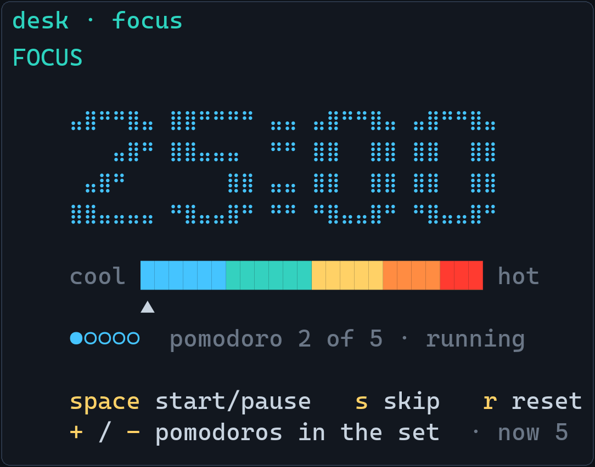
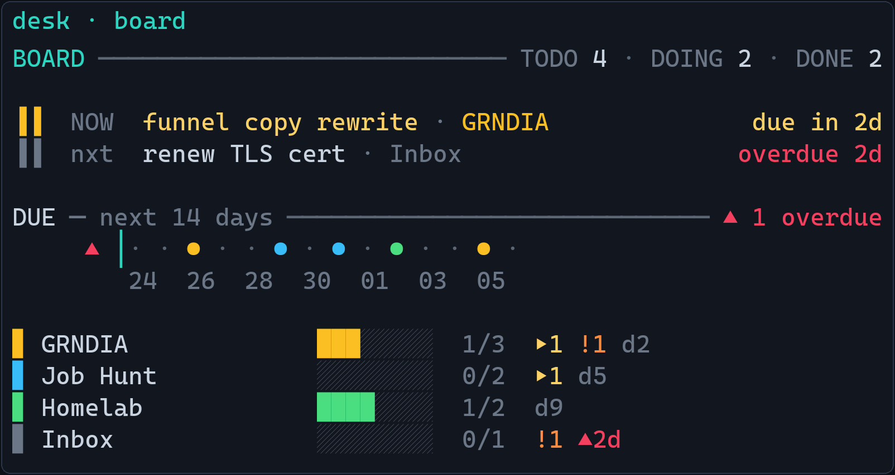
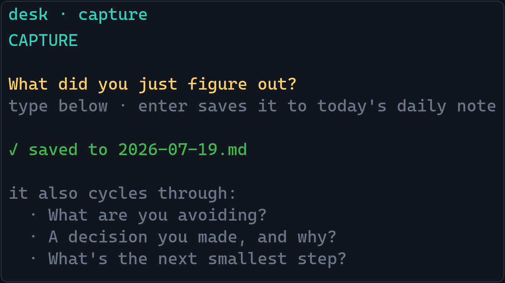
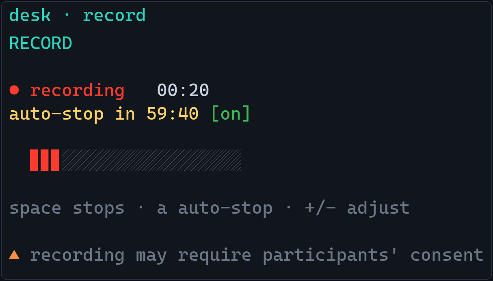

# desk

<p align="center">
  <br>
  <sub>Focus — a braille pomodoro clock that warms cool→hot as the interval runs down.</sub>
</p>

<p align="center">
  
  
</p>


A frameless, always-on-top **widget deck** for the terminal — one window, a compact live strip that expands into panels on demand. Built with [Textual](https://textual.textualize.io/).

Panels:
- **Board** — your current *doing* task and a mini kanban, read live from the [taskboard](https://github.com/jav201/taskboard) app.
- **Focus** — a pomodoro whose clock is a high-res braille dot-matrix, coloured by a cool→hot thermometer of elapsed time.
- **Capture** — a rotating prompt; press enter and the line lands in your Obsidian daily note (or a local file when the vault isn't around).
- **Record** — capture a meeting and transcribe it **locally, fully offline** (opt-in: `pip install -e ".[record]"`).

## Install

`desk` and `taskboard` are two independent tools. `desk` reads taskboard's data file but does **not** depend on its code — so install taskboard too if you want the Board panel populated with your tasks.

```bash
# 1. the widget deck
git clone https://github.com/jav201/desk
cd desk
pip install -e .

# 2. taskboard — so the Board panel has data to show
git clone https://github.com/jav201/taskboard
cd taskboard
pip install -e .
```

Prefer isolated installs? Use `pipx install <path>` in each folder, or `pip install git+https://github.com/jav201/desk` (add the recorder with `pip install "desk[record] @ git+https://github.com/jav201/desk"`).

Run it:

```bash
desk
```

## Keys

| key | action |
|-----|--------|
| `b` | Board panel |
| `f` | Focus panel |
| `c` | Capture panel |
| `m` | Record panel |
| `esc` | collapse to the strip |
| `space` | primary action of the panel — pomodoro start/pause (Focus) · start/stop recording (Record) |
| `s` / `r` | pomodoro skip / reset |
| `+` / `-` | Focus: fewer/more pomodoros · Record: adjust auto-stop ±5 min |
| `a` | Record: toggle auto-stop |
| `o` | open the full board (taskboard) in a new terminal |
| `F5` | refresh the board now |
| `q` | quit |

## Data & config

- **Board** reads `~/.taskboard/board.json` (written by taskboard) read-only, auto-refreshing every ~5s; `F5` forces an instant reload. No taskboard installed? The Board panel simply shows "no board loaded".
- **Focus** persists the pomodoro to `~/.desk/state.json`, so the timer survives a restart.
- **Capture** appends `- YYYY-MM-DD HH:MM  <text>` under a `## Captures` heading in `<vault>/Daily/YYYY-MM-DD.md`. Point it at your vault in `~/.desk/config.json`:

  ```json
  { "vault": "G:/path/to/your/Obsidian/Vault", "daily_subdir": "Daily" }
  ```

  If the vault folder isn't reachable (e.g. a different computer), captures fall back to a single local file `~/.desk/captures.md`, grouped by day — nothing is lost.

## Record — meeting transcription

<p align="center">
  <br>
  <sub>Recording: live level meter, elapsed timer, and the auto-stop countdown.</sub>
</p>

Capture a meeting and get a transcript — **fully local and offline** (no accounts, no cloud, nothing leaves your machine). Opt-in install:

```bash
pip install -e ".[record]"     # from the desk folder; adds soundcard + faster-whisper
```

Transcripts are saved under `~/.desk/transcripts/<timestamp>/` (`audio.wav` + `transcript.md`). Press **`t`** in desk to open that folder in your file manager.

- **`m`** opens the Record panel, **`space`** starts/stops. On stop, a local Whisper model transcribes the audio (downloads once, ~150 MB) and saves it as markdown — the UI never freezes (runs in a background worker).
- Captures **system audio + your mic** (so it hears everyone on the call), mixed to 16 kHz mono.
- **Auto-stop** — so an unattended meeting still gets saved: a countdown auto-stops + transcribes at zero. **`a`** toggles it, **`+`/`-`** adjust it ±5 min (even mid-recording). Default 60 min, on.
- Saved under `~/.desk/transcripts/<timestamp>/` (`transcript.md` + `audio.wav`); auto-stop settings persist in `~/.desk/record.json`.
- Without the extra installed, the panel simply says "install desk[record] to enable".

### Offline / locked-down machines

The model is fetched from Hugging Face on first use. Behind a **corporate TLS-inspecting proxy** you may hit `CERTIFICATE_VERIFY_FAILED` — trust the proxy's root CA (`setx SSL_CERT_FILE`/`REQUESTS_CA_BUNDLE`/`CURL_CA_BUNDLE` to a PEM) and the download works.

Where huggingface.co is **blocked**, pre-fetch the model elsewhere and point desk at a local folder — set **`DESK_WHISPER_MODEL`** to a directory containing `config.json` + `model.bin` (+ tokenizer files):

```powershell
# on a connected machine
huggingface-cli download Systran/faster-whisper-base --local-dir faster-whisper-base
# copy that folder to the locked-down box (share / approved channel), then:
setx DESK_WHISPER_MODEL "C:\models\faster-whisper-base"
```

`DESK_WHISPER_MODEL` also accepts a plain model name (`tiny.en` for a ~40 MB model). A local path loads with **zero network calls** — no proxy, cert, or allowlist involved. If there's genuinely no way to bring the model file onto the box, recording still works (the `audio.wav` is saved); transcription just can't run there.

## Frameless, always-on-top (desktop-widget mode)

Textual can't remove the OS window chrome — the terminal does. Use [WezTerm](https://wezterm.org):

1. Copy the bundled `wezterm.lua` to `~/.wezterm.lua` (WezTerm loads it automatically), or point WezTerm at it with `--config-file`.
2. Run `desk` in that window; it opens borderless.
3. Pin it always-on-top with [PowerToys → Always On Top](https://learn.microsoft.com/windows/powertoys/) (`Win+Ctrl+T`).

`Ctrl+Shift+B` toggles the frame back on; `F11` is borderless fullscreen. (Windows Terminal / PowerShell can't go borderless — that's why WezTerm.)

## Adding a widget (for later)

The deck is built to grow. Each panel is a small module (`desk/board.py`, `desk/focus.py`, `desk/capture.py`) exposing `render_tile(...)` and `render_body(...)`. To add a new widget:

1. Write `desk/<name>.py` with those two renderers (plus any state it needs).
2. In `desk/app.py`: add it to `PANELS`, add a tile entry in `_tiles`, a branch in `_body`, and a hotkey `Binding`.

Panels are deliberately decoupled — data flows through files, not cross-imports — so a new widget slots in without touching the others. A panel registry is the natural refactor once there are more than a handful.

## Disclaimer

Recording conversations may be legally regulated and often requires the **consent of all participants** — laws vary by jurisdiction. **You are solely responsible for using this tool lawfully**, including obtaining any consent required. Please use it responsibly.

This software is provided **"as is", without warranty of any kind**, and the authors accept **no liability** for any use — see [LICENSE](LICENSE).

## Development

```bash
pip install -e ".[test]"
pytest -q
```
