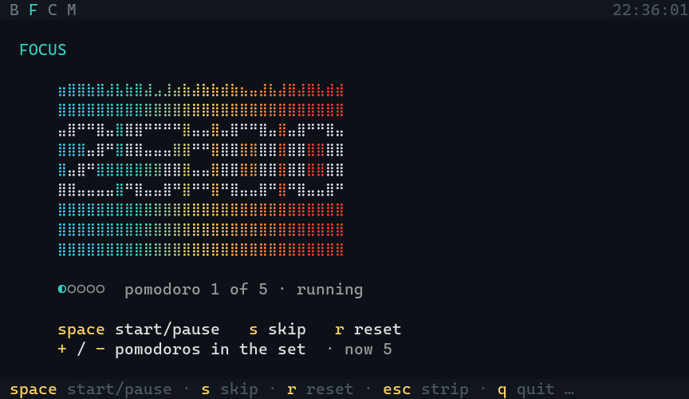
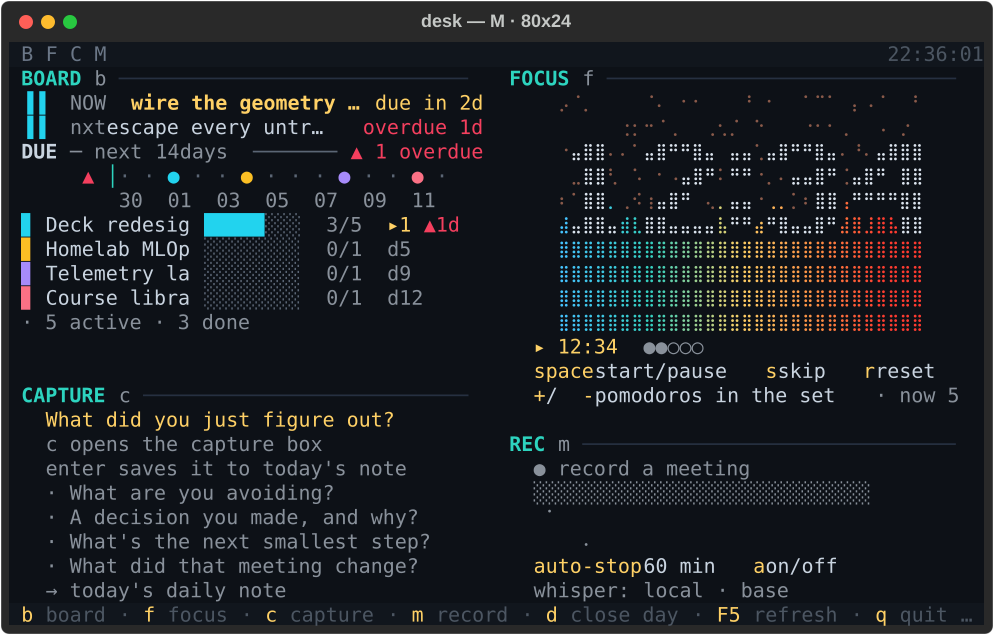
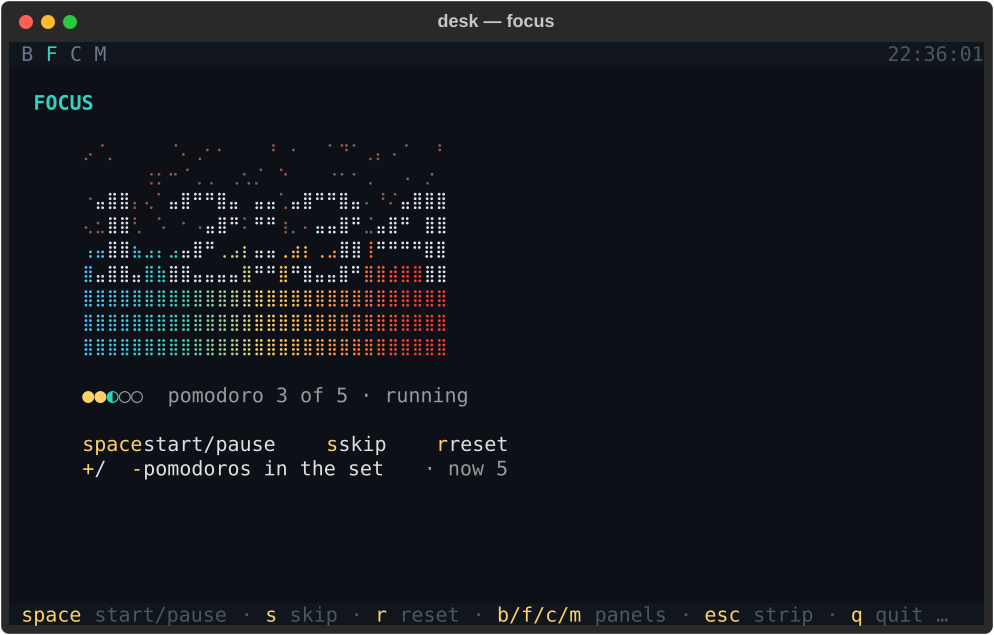
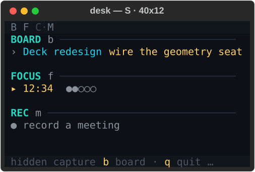
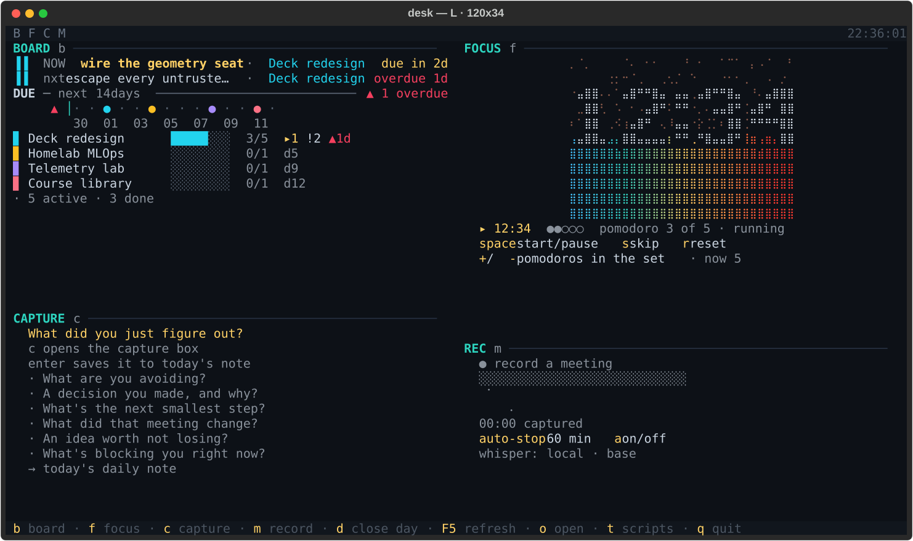
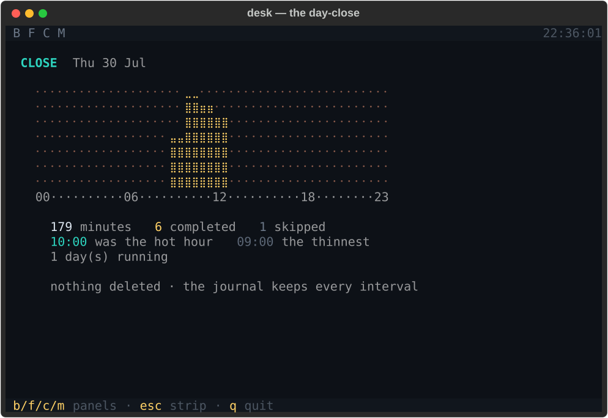
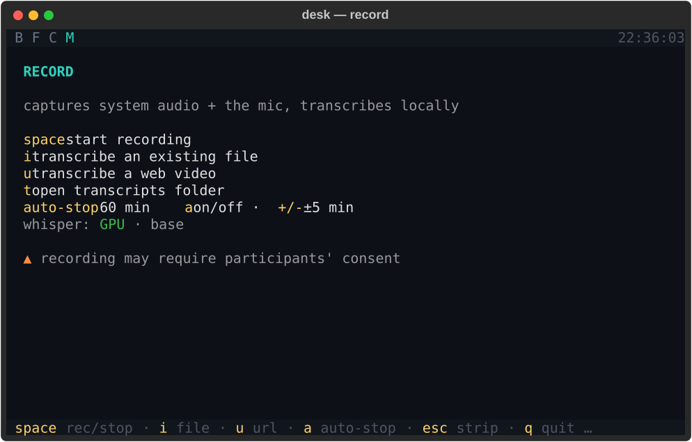

# desk

<p align="center">
  <br>
  <sub>Focus — the clock is carved <em>out of</em> an ember field, and the fire's burn line falls as the interval runs down.</sub>
</p>

<p align="center">
  
</p>
<p align="center">
  <sub>The deck at M (80x24): four cards, each its own idiom, sharing one window.</sub>
</p>


A frameless, always-on-top **widget deck** for the terminal — one window holding four live cards that re-lay themselves out for whatever size the window is, each expanding into a full panel on demand. Built with [Textual](https://textual.textualize.io/).

Panels:
- **Board** — mission control for your work, read live from the [taskboard](https://github.com/jav201/taskboard) app: the task you're on *now*, what's next up, a 14-day due horizon (overdue massed left of the today-rule, one coloured dot per due date), and a per-project progress ledger.
- **Focus** — a pomodoro whose clock is a high-res braille dot-matrix carved *out of* an ember field: a fire whose burn line falls as the interval runs down, leaving ash above it. The line's height is the time left, and its ragged edge breathes.
- **Close** (`d`) — the day's closing entry: twenty-four hours as one braille field, each hour a column as tall as the minutes spent in it, plus the day's completions, skips, hot hour and streak. Every figure is read from the journal; a day with nothing in it says so and prints no number.
- **Capture** — a rotating prompt; press enter and the line lands in your Obsidian daily note (or a local file when the vault isn't around).
- **Record** — capture a meeting and transcribe it **locally, fully offline** (opt-in: `pip install -e ".[record]"`).

<p align="center">
  <br>
  <sub>Focus opened to the whole window: the digits are not printed <em>over</em> the fire, they are cut <em>out</em> of it.</sub>
</p>

## Install

`desk` and `taskboard` are two independent tools. `desk` reads taskboard's data file but does **not** depend on its code — so install taskboard too if you want the Board panel populated with your tasks.

```bash
# 1. the widget deck
git clone https://github.com/jav201/desk
cd desk
pip install -e .

# 2. taskboard — so the Board panel has data to show
git clone https://github.com/jav201/taskboard
cd taskboard
pip install -e .
```

Prefer isolated installs? Use `pipx install <path>` in each folder, or `pip install git+https://github.com/jav201/desk` (add the recorder with `pip install "desk[record] @ git+https://github.com/jav201/desk"`).

Run it:

```bash
desk
```

## Keys

| key | action |
|-----|--------|
| `b` | Board panel |
| `f` | Focus panel |
| `c` | Capture panel |
| `m` | Record panel |
| `d` | Close the day |
| `esc` | back to the deck |
| `space` | primary action of the panel — pomodoro start/pause (Focus) · start/stop recording (Record) |
| `s` / `r` | pomodoro skip / reset |
| `+` / `-` | Focus: fewer/more pomodoros · Record: adjust auto-stop ±5 min |
| `a` | Record: toggle auto-stop |
| `i` | Record: transcribe an audio file already on disk (or paste a URL) |
| `u` | Record: transcribe a web video by URL |
| `x` | Record: cancel a download in flight |
| `t` | Record: open the transcripts folder |
| `o` | open the full board (taskboard) in a new terminal |
| `F5` | refresh the board now |
| `q` | quit |

## The deck resizes

The four cards share the window, and how much each one says depends on how much
room there is. `desk/deck.py` decides it — pure arithmetic, no widgets — and the
app places every card from that decision, so the layout is a thing you can read
and test rather than a thing you have to squint at.

Three sizes, named after the two measured breakpoints in the height each card
gets (`< 5` rows, `>= 12` rows):

| | S · 40x12 | M · 80x24 | L · 120x34 |
|---|---|---|---|
| **cards seated** | 3 — one is shed, and named | 4 | 4 |
| **the focus card** | 38 x 2 | 38 x 14 | 58 x 15 |
| **per card** | its head + its one live line | a prefix of its fields | every declared field |
| **the ember** | given up whole | 10 rows, clock carved | 11 rows, clock carved |
| **the ribbon clock** | dropped below 58 cells | shown | shown |

<p align="center">
  
  
</p>
<p align="center">
  <sub>S (40x12) — three cards, <code>capture</code> shed and named in the key bar · L (120x34) — every declared field seated.</sub>
</p>

A narrow M is a real size and it gives things up too: at 58x14 each card is 27
cells wide, the ember gets 4 rows, and the carved clock — which needs 30 cells —
is renounced whole rather than sliced, so the fire burns bare and the time is
read from the line below it.

Two rules hold at every size:

- **A field is given up whole, never truncated.** A card that cannot afford its
  ember shows no ember — not a sliced one. That is the difference between a
  decision and a bug.
- **Space is earned by information.** A card gets the rows its declared fields
  cost and no more; leftover room goes to the one block per card that genuinely
  scales (more projects, a taller fire), up to a ceiling, and then stops. A card
  with nothing more to say gets nothing, because the same information stretched
  reads worse than the gap did.

When the window is too small to seat every card, the deck sheds one — capture
first, the board last, and never a card that is doing something (a running
timer, a recording). **A shed card is always announced**: the key bar names it
in words, and the ribbon marks its letter. Nothing you could act on leaves the
screen silently. At the very narrowest widths the words give way to keys and
then to a count, because at 28 cells the names and the way out do not both fit
— but the mark stays.

The stage is a *mode*, not a size: `b`/`f`/`c`/`m`/`d` give one card the whole
window, and `esc` brings the deck back. No window is ever wide enough to arrive
there on its own.

<p align="center">
  <br>
  <sub>The day-close (<code>d</code>) — twenty-four hours as one braille field, over a day's real journal.</sub>
</p>

### Regenerating these images

Every image above is captured from the running app, headless:

```bash
python docs/make_assets.py
```

The stills are Textual's own SVG export and the animation is rasterised from the
compositor's styled cells, so an image here cannot show a layout the code cannot
produce. It reads a fixture, never `~/.desk`. If a picture and the program ever
disagree, that command settles it.

## Data & config

- **Board** reads `~/.taskboard/board.json` (written by taskboard) read-only, auto-refreshing every ~5s; `F5` forces an instant reload. No taskboard installed? The Board panel simply shows "no board loaded". Reading is **drift-tolerant**: both the current `phase` schema and the older `status` one are understood, and a task whose format has changed is repaired rather than dropped, so a taskboard upgrade can never make your work vanish from the panel.
- **Focus** persists the live pomodoro to `~/.desk/state.json`, so the timer survives a restart, and appends every interval that ENDS to `~/.desk/pomodoros.jsonl` — one JSON object carrying start, end, seconds and outcome (`completed` / `skipped`). Append-only: nothing is ever rewritten or removed, and a write that fails costs the line and never the timer. It records durations and outcomes only — no note text, no paths, no task names. `reset` writes nothing, because it is the user declaring the set didn't happen. The journal is what the `d` close reads; before it existed, `state.json` carried no timestamp of any kind and yesterday was unrecoverable.
- **Capture** appends `- YYYY-MM-DD HH:MM  <text>` under a `## Captures` heading in `<vault>/Daily/YYYY-MM-DD.md`. Point it at your vault in `~/.desk/config.json`:

  ```json
  { "vault": "G:/path/to/your/Obsidian/Vault", "daily_subdir": "Daily" }
  ```

  If the vault folder isn't reachable (e.g. a different computer), captures fall back to a single local file `~/.desk/captures.md`, grouped by day — nothing is lost.

## Record — meeting transcription

<p align="center">
  <br>
  <sub>The record panel at rest. While recording it shows a live level meter, the elapsed timer and the auto-stop countdown — none of which can be captured honestly without a microphone, so they are described rather than staged.</sub>
</p>

Capture a meeting and get a transcript — **fully local and offline** (no accounts, no cloud, nothing leaves your machine). Opt-in install:

```bash
pip install -e ".[record]"     # from the desk folder; adds soundcard + faster-whisper
```

Transcripts are saved under `~/.desk/transcripts/<timestamp>/` (`audio.wav` + `transcript.md`). Press **`t`** in desk to open that folder in your file manager.

- **`m`** opens the Record panel, **`space`** starts/stops. On stop, a local Whisper model transcribes the audio (downloads once, ~150 MB) and saves it as markdown — the UI never freezes (runs in a background worker).
- Captures **system audio + the mic** (so it hears everyone on the call), mixed to 16 kHz mono.
- **Auto-stop** — so an unattended meeting still gets saved: a countdown auto-stops + transcribes at zero. **`a`** toggles it, **`+`/`-`** adjust it ±5 min (even mid-recording). Default 60 min, on.
- Saved under `~/.desk/transcripts/<timestamp>/` (`transcript.md` + `audio.wav`); auto-stop settings persist in `~/.desk/record.json`.
- Without the extra installed, the panel simply says "install desk[record] to enable".

### Transcribe existing files — `desk-transcribe`

Already have audio (a meeting export, a voice memo)? The `desk-transcribe` command runs the same local, offline model on any file faster-whisper can decode — `.m4a`, `.mp3`, `.wav`, … — no conversion needed. It uses your GPU when one is present (else CPU) and writes `<name>.md` beside each input. Needs the same extra (`pip install -e ".[record]"`).

```bash
desk-transcribe meeting.m4a                 # -> meeting.md
desk-transcribe *.m4a -l es                 # force Spanish, skip auto-detect
desk-transcribe memo.mp3 -m small           # bigger model = better, slower (base is default)
```

`-m/--model` takes any model name or a local path (same values as `DESK_WHISPER_MODEL` below); `-l/--language` forces a language code instead of auto-detecting.

### Transcribe a web video — YouTube and ~1800 other sites

Turn a tutorial, talk or interview into text you can search and skim. desk pulls **only the audio track** (never the video) and runs it through the same local transcriber. Needs one extra: `pip install -e ".[web]"`.

In the app, from the Record panel:

- **`u`** — a URL prompt. If you'd already copied a link, it's offered as a dim suggestion: **copy → `u` → Enter**. Typing replaces it, and it is never submitted on its own.
- **`i`** — the same picker you use for files also accepts a URL; paste one and it switches to a link card.

Either way the audio pours in as a live braille intake field, then the transcript lands next to the audio under `~/.desk/transcripts/<timestamp>-<title>/`. **`x` cancels** a download in flight — it really aborts the transfer and deletes the partial file, unlike `esc`, which just hides the panel and leaves the job running.

From the terminal, `desk-transcribe` takes URLs wherever it takes files:

```bash
desk-transcribe "https://www.youtube.com/watch?v=..."     # -> audio.m4a + audio.md
desk-transcribe "https://…" -l es -m small                # force Spanish, bigger model
```

How it behaves, and why:

- **Audio only, no re-encode.** The site's native stream (m4a/webm/opus) goes straight to faster-whisper, which decodes it via PyAV — so **ffmpeg is not required** and nothing is transcoded.
- **One video, never a playlist.** A playlist or channel link fetches a single video, not the whole list.
- **http(s) only.** Other schemes (`file://`, `ftp://`) are refused — a link must be a link.
- **A 2-hour cap**, checked *before* downloading, so a long livestream can't quietly fill the disk.
- **Opt-in networking.** This extra is the only part of desk that reaches the network; without it installed, desk stays entirely offline and the URL keys say so.

Please respect each site's terms of service and the rights of content owners — use this on material you're allowed to process.

### Offline / locked-down machines

The model is fetched from Hugging Face on first use. Behind a **corporate TLS-inspecting proxy** you may hit `CERTIFICATE_VERIFY_FAILED` — trust the proxy's root CA (`setx SSL_CERT_FILE`/`REQUESTS_CA_BUNDLE`/`CURL_CA_BUNDLE` to a PEM) and the download works.

Where huggingface.co is **blocked**, pre-fetch the model elsewhere and point desk at a local folder — set **`DESK_WHISPER_MODEL`** to a directory containing `config.json` + `model.bin` (+ tokenizer files):

```powershell
# on a connected machine
huggingface-cli download Systran/faster-whisper-base --local-dir faster-whisper-base
# copy that folder to the locked-down box (share / approved channel), then:
setx DESK_WHISPER_MODEL "C:\models\faster-whisper-base"
```

`DESK_WHISPER_MODEL` also accepts a plain model name (`tiny.en` for a ~40 MB model). A local path loads with **zero network calls** — no proxy, cert, or allowlist involved. If there's genuinely no way to bring the model file onto the box, recording still works (the `audio.wav` is saved); transcription just can't run there.

## Frameless, always-on-top (desktop-widget mode)

Textual can't remove the OS window chrome — the terminal does. Use [WezTerm](https://wezterm.org):

1. Copy the bundled `wezterm.lua` to `~/.wezterm.lua` (WezTerm loads it automatically), or point WezTerm at it with `--config-file`.
2. Run `desk` in that window; it opens borderless.
3. Pin it always-on-top with [PowerToys → Always On Top](https://learn.microsoft.com/windows/powertoys/) (`Win+Ctrl+T`).

`Ctrl+Shift+B` toggles the frame back on; `F11` is borderless fullscreen. (Windows Terminal / PowerShell can't go borderless — that's why WezTerm.)

## Adding a widget (for later)

The deck is built to grow. Each panel is a small module (`desk/board.py`, `desk/focus.py`, `desk/capture.py`) exposing `render_tile(...)` (the one live line), `render_body(...)` (the full-window panel) and `render_card(...)` (the deck card at whatever rows it was allotted). To add a new widget:

1. Write `desk/<name>.py` with those three renderers (plus any state it needs).
2. In `desk/deck.py`: declare the card's fields, what each costs, the floor each
   can shrink to, and which single block absorbs leftover rows.
3. In `desk/app.py`: add it to `PANELS`, a tile entry in `_tiles`, a branch in
   `_body` and in `_card_text`, and a hotkey `Binding`.

Panels are deliberately decoupled — data flows through files, not cross-imports — so a new widget slots in without touching the others. A panel registry is the natural refactor once there are more than a handful.

## Disclaimer

Recording conversations may be legally regulated and often requires the **consent of all participants** — laws vary by jurisdiction. **You are solely responsible for using this tool lawfully**, including obtaining any consent required. Please use it responsibly.

This software is provided **"as is", without warranty of any kind**, and the authors accept **no liability** for any use — see [LICENSE](LICENSE).

## Development

```bash
pip install -e ".[test]"
pytest -q
```
